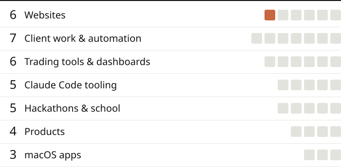

<picture><source media="(prefers-color-scheme: dark)" srcset="assets/banner-dark.svg"></picture>

Solo with **[Naskell](https://naskell.fr)**, as a team with **Orval** (AI integration consulting). **Jouable**, a sports app, is in closed beta. MSc Applied AI at Eugenia School, work-study as a data analyst.

### Public work

<a href="https://github.com/solanathouu/conductor"><picture><source media="(prefers-color-scheme: dark)" srcset="assets/row-01-dark.svg"></picture></a>
<a href="https://github.com/solanathouu/hackaton-Mirakl-public"><picture><source media="(prefers-color-scheme: dark)" srcset="assets/row-02-dark.svg"></picture></a>
<a href="https://github.com/solanathouu/hack-google"><picture><source media="(prefers-color-scheme: dark)" srcset="assets/row-03-dark.svg"></picture></a>
<a href="https://github.com/solanathouu/mcp-gouv"><picture><source media="(prefers-color-scheme: dark)" srcset="assets/row-04-dark.svg"></picture></a>
<a href="https://github.com/solanathouu/LaBonneNote"><picture><source media="(prefers-color-scheme: dark)" srcset="assets/row-05-dark.svg"></picture></a>
<a href="https://github.com/solanathouu/Tube"><picture><source media="(prefers-color-scheme: dark)" srcset="assets/row-06-dark.svg"></picture></a>
<a href="https://github.com/solanathouu/b2b-it-catalog-scraper"><picture><source media="(prefers-color-scheme: dark)" srcset="assets/row-07-dark.svg"></picture></a>

### The 36 private repos

Client sites, automations and products live in private repos. Here is what is in there:

<picture><source media="(prefers-color-scheme: dark)" srcset="assets/private-dark.svg"></picture>

**Stack:** Python, TypeScript, Next.js, React Native, Supabase, Swift, n8n, Claude Code.

[naskell.fr](https://naskell.fr) · [Portfolio](https://portefolio-ten-weld.vercel.app) · [LinkedIn](https://fr.linkedin.com/in/nathan-skwarek-8a3723252) · skwarek.nathan@gmail.com
